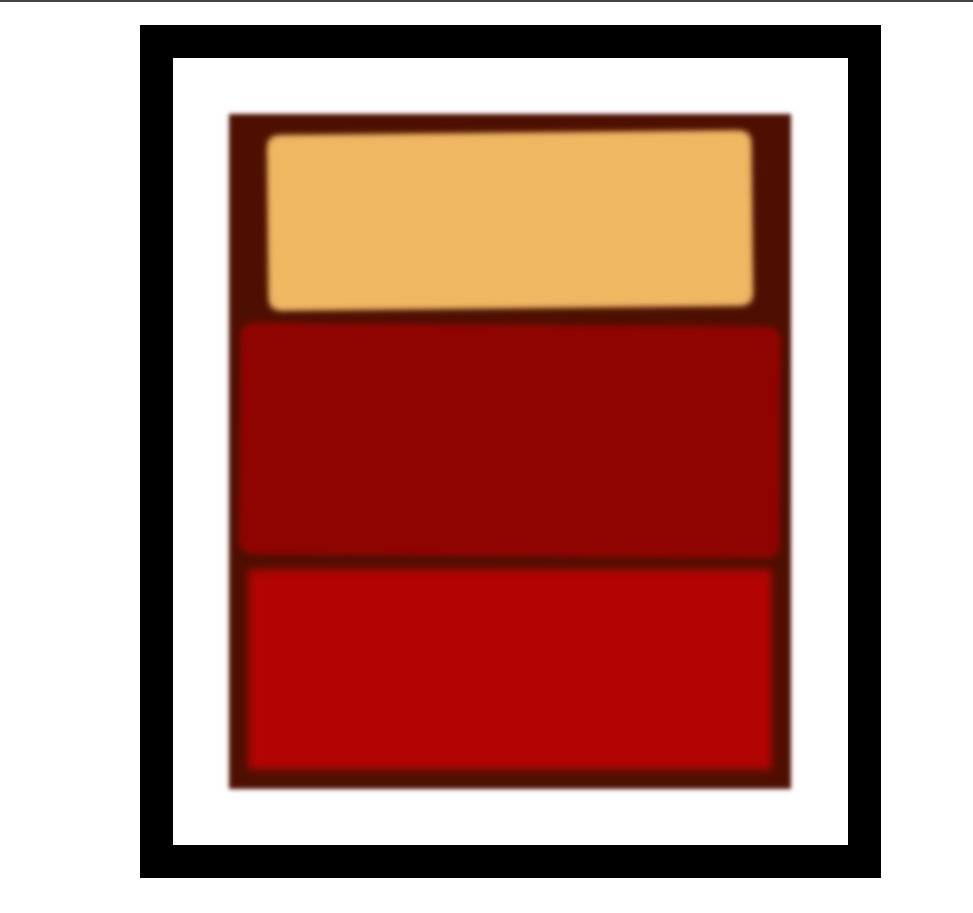

# Rothko-Painting
Làm quen với Box model với tác phẩm của họa sĩ Mark Rothko

# Học được
*   Cách tạo viền với border
*   Hiện tượng margin collapsing
*   Biết cách căn giữa phần tử block đã định chiều rộng bằng margin auto
*   Cách khai báo tắt margin, padding
*   Cách làm mờ phần tử bằng filter: blur()
*   Cách tạo bóng thông qua box-shadow
*   Cách bo tròn viền với border-radius
*   xoay đối tượng với transform: rotate()
# Công nghệ
*   HTML5
*   CSS3
